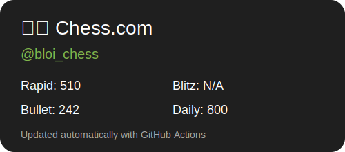

# Hi there 👋 I'm Bloi-Dev

## 🚀 About Me

* 💻 Software Engineering student and developer
* 🐍 Working with Python, Discord bots, and Web development
* 🤖 Building automation tools and AI-powered applications
* 🌱 Currently learning advanced software engineering concepts
* 🎯 Interested in backend systems, DevOps, and machine learning

## 🔨 Current Projects

* **Project Zeta** — Discord bot + WebUI for managing student channels and generating summaries
* Personal automation tools and experiments

## 🛠️ Tech Stack

### Languages

* Python
* Java
* JavaScript
* SQL
* C++

### Frameworks & Tools

* Discord.py
* Flask / FastAPI
* Git & GitHub
* Docker
* Linux
* PostgreSQL

## 📈 GitHub Stats

## ♟️ Chess.com

## 🌐 Connect With Me

* LinkedIn: [in/brandon-loi](https://www.linkedin.com/in/brandon-loi)

---

*"Always building, always learning."*
